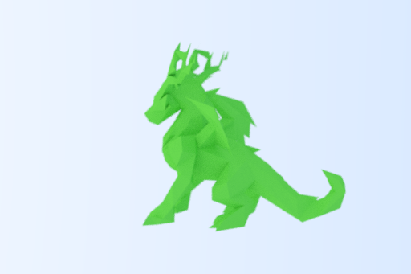

# RusTX
- Jerry Zhang (jerryz10)
- Shanrong (sw101)
- Pranav (ppopuri2)

## Project Introduction
Multi-threaded ray tracer implemented in rust.
* Import 3D models `(.stl)`
* Render model as a `.png`

### Motivation
We use software such as Blender and CAD softwares, which use ray tracing software to render their models. To better understand how these softwares work, as well as learn the technical details behind the algorithms, we decided to build a ray tracer in rust. Also, since ray tracers are traditionally made in C++, this lets us compare the benefits of Rust over C++ as well as get familiar with multi-threaded Rust.

We will likely use image crates, such as `image`, and other crates for parsing `stl` files, as well as command line arguments.

## Technical Overview
- [x] Complete Ray Tracing Tutorial
- [x] Make Ray Tracing multi-threaded (checkpoint 1)
- [x] Render geometries other than spheres
- [x] Parse `.stl` files
- [x] Render model.
- [ ] Multiple `.stl` files
- [ ] Custom Skybox
- [ ] Optimization (BVH)
- [ ] Command-line arguments (`clap`)
- [ ] Add debugging markers (like axes, etc.)
- [ ] Final Scene: animated GIF of scene

## Possible Challenges
- Parsing `.stl` files may be difficult.
- Math behind geometries other than spheres may be very technical.

## Showcase

> Dragon rendered from `.stl` file

## Running
See [`RUN.md`](RUN.md)

# Inspirations
- Ray Tracing Road to Rust: https://the-ray-tracing-road-to-rust.vercel.app/
- Scratchapixel: https://www.scratchapixel.com/index.html